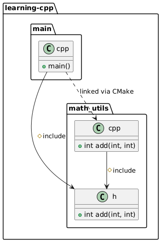
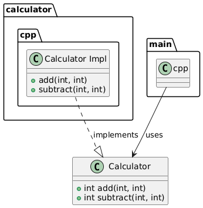

# 💯 100 Days of Learning C++

> 🧠 Goal: Learn C++ effectively for embedded Linux and automotive development, mastering header files, CMake, unit testing, and clean code practices.

## 📅 Day 1 — [2025-03-30]

### ✅ Topics Covered

#### 1. Header & Source Files

- Learned how to declare functions in `.h` files and define them in `.cpp` files.
- Understood the role of include guards (`#ifndef`, `#define`, `#endif`) to prevent redefinitions.
- Saw how header files act as contracts that must be implemented by source files.

#### 2. CMake Basics

- Created a basic `CMakeLists.txt` to compile `main.cpp` and `math_utils.cpp`.
- Understood how CMake automates separate compilation and linking.

#### 3. Bash Automation

- Created a `build_and_run.bash` script to automate:
  ```bash
  cd build
  cmake ..
  cmake --build .
  ./my_program
  ```
- Ran it successfully using Git Bash on Windows.

#### 4. C++ Syntax Understanding

- Broke down this line:
  ```cpp
  std::cout << add(2, 3) << std::endl;
  ```
  - `std::cout`: console output
  - `<<`: stream insertion
  - `std::endl`: newline + flush

#### 5. Code Splitting with a Class

- Defined a `Calculator` class with `add()` and `subtract()` methods.
- Learned how to split class declaration and implementation across `.h` and `.cpp`.

#### 6. Visualized Concepts with PlantUML

- Understood flow between main → header → source via simple diagrams.
- Used `@startuml` / `@enduml` structure to describe relationships.

### 📁 Files Created

```
learning-cpp/
├── CMakeLists.txt
├── build_and_run.bash
├── main.cpp
├── math_utils.h
├── math_utils.cpp
├── calculator.h
├── calculator.cpp
└── diagrams/
    └── class_structure.puml
```

#### Relation



#### Class Diagram



### 📝 Reflections

- Seeing how C++ builds from pieces (headers, sources, linking) helped a lot.
- Output syntax (`std::cout`) makes more sense now after breaking it down.

### 🔜 Next Goals (Day 2 Plan)

- Add `multiply()` and `divide()` to `Calculator` (with divide-by-zero check)
- Add `namespace`
- Begin setting up **GoogleTest** for unit testing
