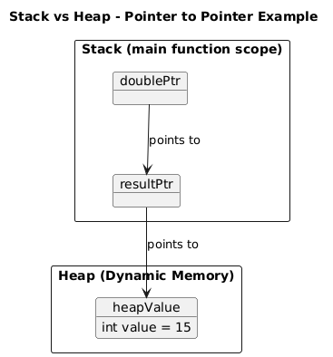

# Day 004: Advanced Pointers – Stack vs Heap, Pointer to Pointer, Dispatch Table

## 🧠 Concepts Covered

| Concept                  | Summary                                                               |
| ------------------------ | --------------------------------------------------------------------- |
| Stack                    | Memory used for function calls, local variables, return addresses     |
| Heap                     | Memory allocated dynamically using `new`; must be freed with `delete` |
| Pointer                  | Stores the memory address of another variable                         |
| Double Pointer (`int**`) | Stores the address of a pointer                                       |
| Dynamic Allocation       | Use `new` to allocate memory on the heap                              |
| Function Pointer Array   | Array of function pointers used as a dispatch table                   |
| Stack vs Heap            | Stack is fast and automatic; Heap is flexible but manual              |



## ✅ Code Summary – Calculator with Advanced Pointer Concepts

```cpp
#include "calculator.h"
#include <iostream>

int main()
{
    int a = 10, b = 5;

    // Dispatch table
    MathOp operations[] = {add, subtract, multiply, divide};

    // Pointer to Pointer
    int *resultPtr = new int;     // Dynamically allocate result to a pointer
    int **doublePtr = &resultPtr; // Pointer to result pointer

    *resultPtr = operations[0](a, b); // result of operation 0 (add) is stored into the value of resultPtr

    std::cout << "Addition: " << **doublePtr << std::endl; // Dereference twice to get the value

    delete resultPtr; // Free heap memory
    return 0;
}
```

## 🧩 Memory Explanation

### Stack

- Stores function parameters, return addresses, local variables like `resultPtr`, `doublePtr`, `a`, and `b`.

### Heap

- Stores dynamically allocated memory with `new`, e.g., the value pointed by `*resultPtr`.

## ✅ TL;DR Obsidian Notes

| Concept        | Notes                                                          |
| -------------- | -------------------------------------------------------------- |
| Pointer        | On stack by default when declared locally                      |
| `new` value    | Lives on the heap                                              |
| `delete`       | Required to release memory from the heap                       |
| Double Pointer | A pointer that stores the address of another pointer (`int**`) |
| Dispatch Table | Function pointer array for calling functions dynamically       |
| Stack          | Auto-managed, fast, short-lived variables and frames           |
| Heap           | Manual-managed, for flexible long-lived data                   |

---

✅ **Next**: Dynamic arrays with pointer arithmetic, stack frame exploration, and class-based calculator using function pointers.

🧠 Great progress today, Sree!
