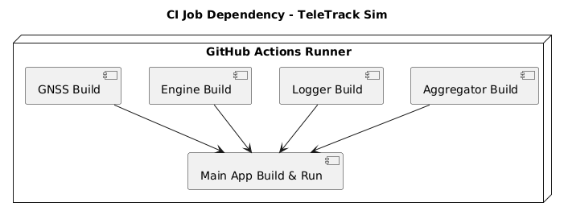
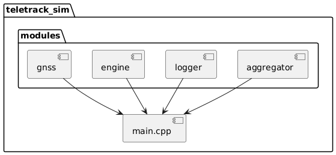

## 🚀 Day 006 – GitHub Actions CI for TeleTrack Sim (CMake DAG)

### 🗂️ Overview

This GitHub Actions workflow sets up a **DAG-based Continuous Integration pipeline** for the **TeleTrack Sim** C++ project. Each core module (`gnss`, `engine`, `logger`, `aggregator`) is built in parallel. The main application (`teletrack_sim`) is compiled and executed only after all modules build successfully.

### 📁 Workflow File

```bash
.github/workflows/cpp-ci-teletrack-dag.yml
```

### 📌 CI Workflow Trigger Conditions

```yaml
on:
  push:
    paths: ["teletrack_sim/**"]
    branches: ["master", "D00*"]
  pull_request:
    paths: ["teletrack_sim/**"]
    branches: ["master", "D00*"]
```

### 📐 CI Structure – Module Build Flow

> 📝 Each module has:
>
> - Its own `CMakeLists.txt`
> - Independent compilation unit
> - A common interface used by `main.cpp` for simulation orchestration

### 🔧 GitHub CI Jobs Breakdown





#### ✅ Individual Jobs (parallel):

- `gnss` → `cmake -S modules/gnss -B build/gnss`
- `engine` → `cmake -S modules/engine -B build/engine`
- `logger` → `cmake -S modules/logger -B build/logger`
- `aggregator` → `cmake -S modules/aggregator -B build/aggregator`

#### 🔁 Main App Job (sequential):

- Depends on: `gnss`, `engine`, `logger`, `aggregator`
- Builds complete project from root: `cmake -S . -B build`
- Runs executable: `./build/teletrack_sim`

### 🧪 Test & Future Enhancements

- ✅ Verify successful builds for each module
- ❌ Unit tests not yet implemented
- 🔜 Future Additions:
  - Add GoogleTest suites per module
  - Static analysis (clang-tidy / cppcheck)
  - Linting and MISRA compliance tools
  - Code coverage and caching

### 🧭 Summary

| Component    | Role                      | Job Name in CI                        |
| ------------ | ------------------------- | ------------------------------------- |
| `gnss`       | Simulates GNSS module     | `Configure + Build GNSS Module`       |
| `engine`     | Simulates Engine module   | `Configure + Build Engine Module`     |
| `logger`     | Logs simulation data      | `Configure + Build Logger Module`     |
| `aggregator` | Aggregates module output  | `Configure + Build Aggregator Module` |
| `main.cpp`   | Runs TeleTrack simulation | `Build + Run Full App`                |
