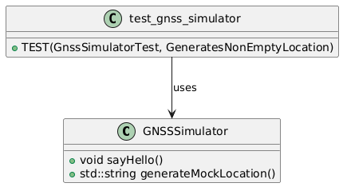

# 🧭 Day 007 – GoogleTest, CMake, and Conan Integration in `TeleTrackSim`

## ✅ Objective  
Set up a clean, testable C++ workflow using:
- GoogleTest (via Conan)
- Modularized CMake structure
- Automated build + test script
- Run everything inside native WSL (no Docker)

## 📘 Summary of All Steps

| Step | Description |
|------|-------------|
| 1 | Set up `.venv` Python environment inside WSL |
| 2 | Installed Conan via pip and created a Conan profile |
| 3 | Added dependencies: `gtest`, `paho-mqtt-c`, `paho-mqtt-cpp` in `conanfile.txt` |
| 4 | Integrated `CMakeDeps` and `CMakeToolchain` as Conan generators |
| 5 | Updated root `CMakeLists.txt` with `enable_testing()` and module linking |
| 6 | Modified `modules/gnss/CMakeLists.txt` to build `test_gnss` using GTest |
| 7 | Added a simple test for `GNSSSimulator::generateMockLocation()` |
| 8 | Verified `ctest` integration via `add_test()` |
| 9 | Updated `build-wsl.sh` to include testing (`-DBUILD_TESTING=ON`) |
| 10 | Verified IntelliSense with `.vscode/c_cpp_properties.json` include paths |

## 🐞 Issues and Fixes

| Issue | Cause | Fix |
|-------|-------|-----|
| `std::string` not found in header | `<string>` not included | Added `#include <string>` in `gnss_simulator.h` |
| `generateMockLocation()` not defined | Signature mismatch | Matched header and `.cpp` implementation |
| `No tests found` | CTest not triggered | Added `enable_testing()` and `-DBUILD_TESTING=ON` |
| GTest header squiggles in VSCode | VSCode can’t resolve Conan paths | Added include path to `.vscode/c_cpp_properties.json` |
| Build artifacts polluting root | Default Conan/CMake behavior | Used `-of=build` and structured output folder |

## 📁 Folder Structure (Essential View)

```
teletrack_sim/
├── build-wsl.sh
├── conanfile.txt
├── CMakeLists.txt
├── modules/
│   └── gnss/
│       ├── include/
│       │   └── gnss_simulator.h
│       ├── src/
│       │   └── gnss_simulator.cpp
│       └── test/
│           └── test_gnss_simulator.cpp
```

## 🧪 Test Result (via `ctest`)

```
1/1 Test #1: GnssTests ......................   Passed    0.01 sec
100% tests passed, 0 tests failed out of 1
```

## 🔌 Conanfile.txt

```ini
[requires]
paho-mqtt-c/1.3.9
paho-mqtt-cpp/1.2.0
gtest/1.14.0

[generators]
CMakeDeps
CMakeToolchain
```

## ⚙️ Root CMakeLists.txt

```cmake
cmake_minimum_required(VERSION 3.15)
project(TeleTrackSim)

set(CMAKE_CXX_STANDARD 17)
enable_testing()

find_package(PahoMqttCpp REQUIRED)

add_subdirectory(modules/gnss)
add_subdirectory(modules/engine)
add_subdirectory(modules/logger)
add_subdirectory(modules/aggregator)

add_executable(teletrack_sim main.cpp)

target_link_libraries(teletrack_sim
    gnss_simulator
    engine_simulator
    logger
    aggregator
    PahoMqttCpp::paho-mqttpp3-static
)
```

## 📦 GNSS Module CMakeLists.txt

```cmake
add_library(gnss_simulator
    src/gnss_simulator.cpp
)

target_include_directories(gnss_simulator PUBLIC include)

if (BUILD_TESTING)
    find_package(GTest REQUIRED)

    add_executable(test_gnss test/test_gnss_simulator.cpp)
    target_link_libraries(test_gnss
        gnss_simulator
        GTest::gtest_main
    )

    add_test(NAME GnssTests COMMAND test_gnss)
endif()
```

## 🧪 Test Code

```cpp
#include <gtest/gtest.h>
#include "gnss_simulator.h"

TEST(GnssSimulatorTest, GeneratesNonEmptyLocation) {
    GNSSSimulator sim;
    std::string loc = sim.generateMockLocation();
    ASSERT_FALSE(loc.empty());
    ASSERT_NE(loc.find("latitude"), std::string::npos);
    ASSERT_NE(loc.find("longitude"), std::string::npos);
}
```

## 📦 build-wsl.sh (Final Version)

```bash
#!/bin/bash
set -e

CLEAN_BUILD=false
if [[ "$1" == "--clean" ]]; then
  CLEAN_BUILD=true
  echo "🧹 Clean build requested."
fi

if ! dpkg -s python3-venv &> /dev/null; then
    echo "🧱 Installing python3-venv..."
    sudo apt update && sudo apt install -y python3-venv
fi

if [ ! -d ".venv" ]; then
    echo "🌱 Creating virtual environment..."
    python3 -m venv .venv
fi

echo "🔁 Activating .venv..."
source .venv/bin/activate

if ! command -v conan &> /dev/null; then
    echo "📦 Installing Conan..."
    pip install conan
fi

conan profile detect --force

if $CLEAN_BUILD; then
  rm -rf build
fi

mkdir -p build

echo "📦 Installing dependencies via Conan..."
conan install . -of=build --build=missing --conf tools.cmake.cmaketoolchain:generator=False

echo "🛠 Configuring CMake..."
cmake -S. -Bbuild \
  -DCMAKE_TOOLCHAIN_FILE=build/conan_toolchain.cmake \
  -DCMAKE_BUILD_TYPE=Release \
  -DBUILD_TESTING=ON

echo "🔨 Building project..."
cmake --build build -- -j$(nproc)

echo "🧪 Running unit tests..."
cd build
ctest --output-on-failure
cd ..

echo "🚀 Running TeleTrackSim..."
./build/teletrack_sim
```

## 📘 Code: GNSS Simulator

**gnss_simulator.h**

```cpp
#pragma once
#include <string>

class GNSSSimulator {
public:
    void sayHello();
    std::string generateMockLocation();
};
```

**gnss_simulator.cpp**

```cpp
#include "gnss_simulator.h"
#include <iostream>

void GNSSSimulator::sayHello() {
    std::cout << "[GNSS]: Hello from GNSS Simulator!" << std::endl;
}

std::string GNSSSimulator::generateMockLocation() {
    return R"({"latitude":1.3521,"longitude":103.8198})";
}
```

## 🧩 UML – Module & Test Relationship




## 🧠 Key Takeaways

| Topic | Learning |
|-------|----------|
| Conan 2 | Uses `CMakeDeps` and `CMakeToolchain` instead of old `cmake` generator |
| CTest | Needs `enable_testing()` and `add_test()` to work |
| Testing | Best done inside `if (BUILD_TESTING)` block in module-level CMake |
| VSCode | Needs `c_cpp_properties.json` with Conan include paths to resolve headers |
| Automation | `build-wsl.sh` now does everything — venv, Conan, CMake, build, test, run |

## 🧰 `build-wsl.sh` – Dev Automation Script for WSL
### 📌 Purpose  
This script automates the entire C++ build pipeline for the `TeleTrackSim` project in **WSL**, covering:
- Python venv creation
- Conan dependency management
- CMake toolchain setup
- Optional unit testing with GoogleTest
- Application execution
### ✅ Features

| Feature | Description |
|--------|-------------|
| `--clean` | Removes the `build/` folder before configuring |
| `--test` | Enables CMake's `BUILD_TESTING` flag and runs `ctest` |
| Python venv | Creates `.venv` to isolate Conan installation |
| Conan 2.x | Automatically installs project dependencies (GTest, MQTT) |
| CMake + Conan integration | Uses `CMakeToolchain` and `CMakeDeps` for configuration |
| Native execution | Runs the `teletrack_sim` binary at the end |
| Modular | Easy to extend for flags like `--skip-run` or `--only-test` |

### 🚀 Usage Examples

| Command | Behavior |
|---------|----------|
| `./build-wsl.sh` | Build and run app without tests |
| `./build-wsl.sh --test` | Build, run unit tests, then run app |
| `./build-wsl.sh --clean` | Clean previous build, build again |
| `./build-wsl.sh --clean --test` | Full rebuild, test, and execute app |

## 🧠 Step-by-Step Breakdown

| Step | Description |
|------|-------------|
| **Argument Parsing** | Detects `--clean` and `--test` flags and sets local shell variables |
| **Python venv check** | Installs `python3-venv` if missing |
| **Virtual Environment Setup** | Creates `.venv` folder and activates it |
| **Conan Install** | Installs Conan into `.venv` if not present |
| **Profile Setup** | Auto-detects the Conan profile using `conan profile detect` |
| **Build Folder Prep** | Optionally deletes `build/`, then recreates it |
| **Dependency Resolution** | Calls `conan install` using `CMakeToolchain` and `CMakeDeps` |
| **CMake Configuration** | Configures the project and enables test build if `--test` was used |
| **Project Build** | Builds the full project with `cmake --build` |
| **Unit Test Execution** | If `--test` is passed, runs `ctest --output-on-failure` |
| **Run App** | Executes `./build/teletrack_sim` at the end |
