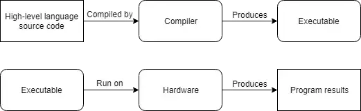
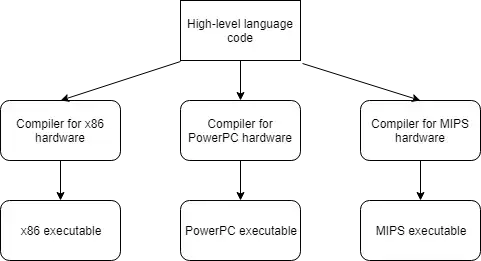

| Links          |                                                                                                                                                                                                               |
| -------------- | ------------------------------------------------------------------------------------------------------------------------------------------------------------------------------------------------------------- |
| Stack Overflow | [compilation - Difference between compiled and interpreted languages? - Stack Overflow](https://stackoverflow.com/questions/38491212/difference-between-compiled-and-interpreted-languages/38491646#38491646) |
| learncpp       | [0.2 — Introduction to programs and programming languages – Learn C++](https://www.learncpp.com/cpp-tutorial/introduction-to-programming-languages/)                                                          |

| Concept                            | Note                                                                                                                                                                                                                                                                                                                                                                                                                                                                                                                                                                                                                         | Link |
| ---------------------------------- | ---------------------------------------------------------------------------------------------------------------------------------------------------------------------------------------------------------------------------------------------------------------------------------------------------------------------------------------------------------------------------------------------------------------------------------------------------------------------------------------------------------------------------------------------------------------------------------------------------------------------------- | ---- |
| Computer Program                   | Set of instructions to run on a computer                                                                                                                                                                                                                                                                                                                                                                                                                                                                                                                                                                                     |      |
| Programming Language               | Language to write the instructions                                                                                                                                                                                                                                                                                                                                                                                                                                                                                                                                                                                           |      |
| Programming                        | Act of writing a program                                                                                                                                                                                                                                                                                                                                                                                                                                                                                                                                                                                                     |      |
| [[Machine Language]]               | Instructions that can be understood by CPU                                                                                                                                                                                                                                                                                                                                                                                                                                                                                                                                                                                   |      |
| [[Platform]]                       | Compatible set of hardware and software                                                                                                                                                                                                                                                                                                                                                                                                                                                                                                                                                                                      |      |
| [[Portable]]                       | A program that can be transferred from one paltform to another                                                                                                                                                                                                                                                                                                                                                                                                                                                                                                                                                               |      |
| [[Porting]]                        | Act of modifying program so that it runs on another platform                                                                                                                                                                                                                                                                                                                                                                                                                                                                                                                                                                 |      |
| [[Assembly Language]]              | More human readable than machine language  CPUs do not understand assembly language                                                                                                                                                                                                                                                                                                                                                                                                                                                                                                                                 |      |
| [[Assembler]]                      | Translates assembly language into machine langugage                                                                                                                                                                                                                                                                                                                                                                                                                                                                                                                                                                          |      |
| [[Low Level Langugages]]           | Really fast, still used where performance critical   Machine language and assembly language are considered low level languages  1. Provides limited abstraction  2. Needs knowledge of architecture  3. Hard to understand  4. Language only has limited capabilities                                                                                                                                                                                                                                                                                                                                |      |
| [[High Level Languages]]           | [[C]], [[⚓ C++\|C++]], [[Pascal]] etc are all developed to mitigate this issue   High level languages need to translated into machine language before they can be run                                                                                                                                                                                                                                                                                                                                                                                                                                               |      |
| **[[Compiler]]**                   |    Compiler reads the source of one language (usually a high level language) and translate it into a lower level language  C++ Compiler reads the C++ source code and translate it into machine code   C++ compilers can be configured to generate assembly code (useful to see what the compiler is generating)  Once completed, this can be packaged into an [[Executable]] and can be launched by the OS. Executables does not need compilers to be installed  Compiled programs does not require distributing the source code. This is good for IP protection purposes |      |
| [[Interpreter]]                    | Interpreter directly executes the instructions in the source code without being compiled first  More flexible than others but inefficient (Interpreter needs to run every time)  Interpreter also needs to be run in every machine the program is running on   ![[0.2 Introduction to programs and programming languages.png]]                                                                                                                                                                                                                                                                             |      |
| Advantages of High Level Languages | Faster                          Easier to write                 More portable (cross platform)                                                                                                                                                                                                                                                                                                                                                                                                                                                                                |      |

