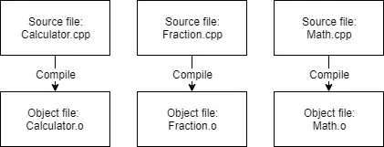
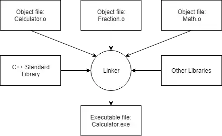
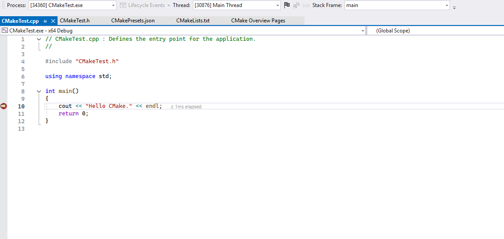

| Concept                                   | Note                                                           | Link |
| ----------------------------------------- | --------------- | ---- |
| [[Dennis Ritchie]]                        | Developed C in [[Bell Telephone Laboratories]] in 1972                                                                                                    |      |
| [[American National Standards Institute]] | Amrican National Standards Institute                                                                                          |      |
| [[C]]                                     | Developed by [[Dennis Ritchie]]  Most of the Unix Operating System was rewritten using C in 1973  C99 released in 1999  |      |
| [[⚓ C++\|C++]]                            | Developed by [[Bjarne Stroustrup]] at [[Bell Telephone Laboratories]]  Superset of [[C]]  Major innovation is that it supports [[⚓ Object Oriented Principles\|OOP]]  Standardized in 1998   |      |
| [[The C Programming Language]]            | [[Brian Kernighan]] and [[Dennis Ritchie]] in 1978  De facto standard for C Programming |      |
| [[Bug]]                                      | Any programming Error that prevents the program from working correctly   The term _bug_ was first used by Thomas Edison back in the 1870s! However, the term was popularized in the 1940s when engineers found an actual moth stuck in the hardware of an early computer, causing a short circuit. Both the log book in which the error was reported and the moth are now part of the Smithsonian Museum of American History. It can be viewed [here](https://americanhistory.si.edu/collections/nmah_334663)  Only 10 to 40% of time is spent on writing the initial program and the remaining time is spent on maintenance like debugging |
| Tools to be used                             | [Coding Font](https://www.codingfont.com/) and [Programming Fonts](https://www.programmingfonts.org/) both have neat tools that allow you to compare different coding fonts to see which ones you like best.|
|Best Practice|Name the first/primary source code file in each program main.cpp. This makes it easy to determine which source code file is the primary one.|
| [[Compiler]]         | 1. Checks if the rules of the language are followed. Else it will give an error until the issue is fixed   2. Translates the C++ code to [[Machine Language]] instructions. The instructions are stored in a temporary file called [[Object File]]. The Object file stores data needed for [[Linker]]  Naming is `name.o` or `name.obj`                                    ||
| [[Linker]]           | Linker combine all the object files and produce a desired output file  1. Go through each [[Object File]] and make sure they are valid   2. Checks for dependencies are resolved properly. If we define something in one cpp file and use it in another cpp file, linker connects it together. If the definition does not match the reference, it will create an error  3. Links one or more library files (Precompiled code that have been packaged up for reuse in other programs)  4. Outputs the desired output file  ||
| [[Standard Library]] |                                                                                              |
| [[Building]]         | Converting source code into executables that can be run. The result of build is called a build                                    |
| [[Testing]]          | Makes sure that the programs work as expected|

## Hello World from VStudio2022
Restarting for the n'th time, this time, more resilient than before. Completing the 10 hard days. Ofcourse, the first 1 million is the hardest, (that's how the mythlogy goes!)

