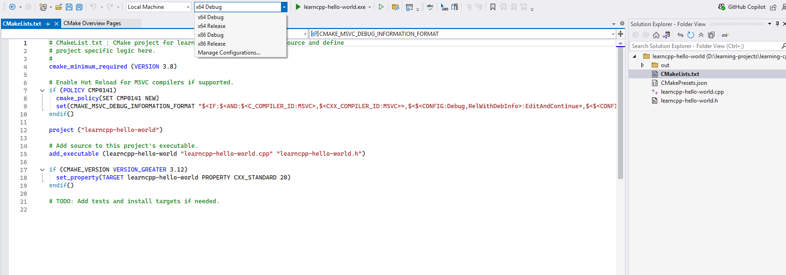

| Concept                   | Note                                                                                                      |
| ------------------------- | --------------------------------------------------------------------------------------------------------- |
| [[Build Configuration]]   | A collection of project settings that determines how your IDE will build your projec                      |
| [[Debug Configuration]]   | Designed to help you debug your program, and is generally the one you will use when writing your programs |
| [[Release Configuration]] | Designed to be used when releasing your program to the public                                             |
