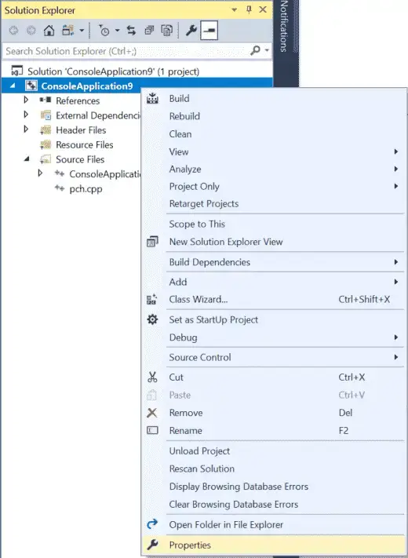

# Note

We are using CMake to have a taste of how it works under the hood and will not be using Standard VStudio Solutions

# C++ Standards

| Publication Year | Formal Name        | Conventional name | Development name | Notes                                    |
| ---------------- | ------------------ | ----------------- | ---------------- | ---------------------------------------- |
| 2011             | ISO/IEC 14882:2011 | C++11             | C++0x            |                                          |
| 2014             | ISO/IEC 14882:2014 | C++14             | C++1y            |                                          |
| 2017             | ISO/IEC 14882:2017 | C++17             | C++1z            |                                          |
| 2020             | ISO/IEC 14882:2020 | C++20             | C++2a            |                                          |
| 2024             | ISO/IEC 14882:2024 | C++23             | C++2b            | Finalized (technically complete) in 2023 |
| TBD              | TBD                | C++26             | C++2c            |                                          |

# CMake Commands

| Title                           | Description                                                                                          | Example                             |
| ------------------------------- | ---------------------------------------------------------------------------------------------------- | ----------------------------------- |
| [[CMAKE_CXX_STANDARD]]          | Ensures that the compiler uses the specified standard, enabling the corresponding language features. | set(CMAKE_CXX_STANDARD 20)          |
| [[CMAKE_CXX_STANDARD_REQUIRED]] | Enforces strict compliance with the specified C++ standard                                           | set(CMAKE_CXX_STANDARD_REQUIRED ON) |
| [[CMAKE_CXX_EXTENSIONS]]        | Disables compiler-specific extensions, ensuring that only standard C++ features are used             | set(CMAKE_CXX_EXTENSIONS OFF)       |

# Compiler Warning Formatting

