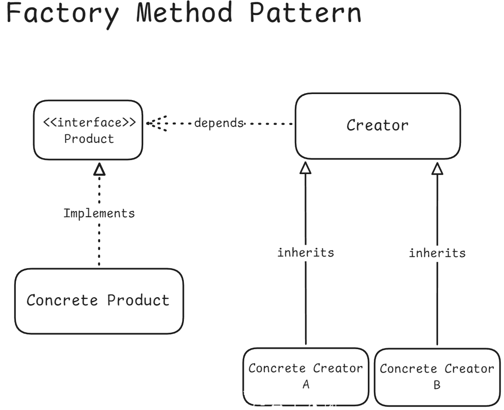
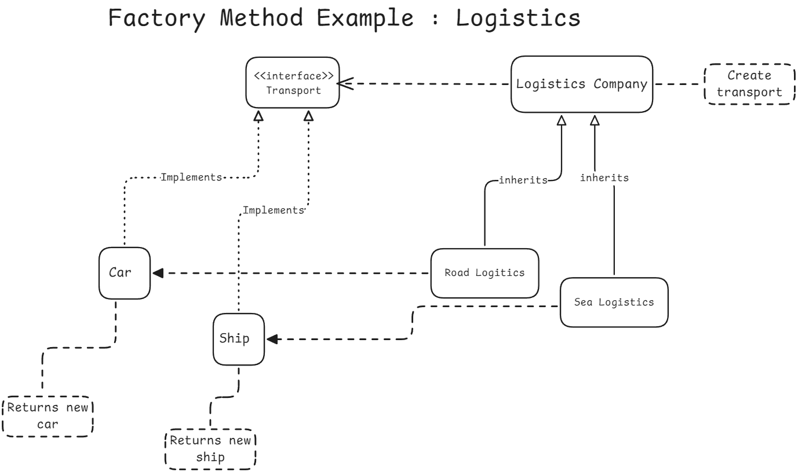

# Transport Simulation - Factory Method Pattern (C++)



This project demonstrates a real-world C++ implementation of the Factory Method Design Pattern through a simple Transport Simulation example.

We implement different types of transport (Car, Ship) that inherit from a common Transport interface and simulate deliveries, maintenance, and capacity handling.

## Concepts Covered

- Factory Method Design Pattern
- Abstract Base Classes (Interfaces)
- Pure Virtual Functions and Polymorphism
- Public Inheritance and IS-A Relationship
- Const-correctness (const methods vs non-const methods)
- Pre-increment (++i) vs Post-increment (i++) behavior
- Clean C++ Folder Structure (include/ and src/)
- Modern CMake project setup

## Project Structure

```

transport-sim/
├── include/
│ ├── Transport.h # Abstract interface
│ ├── Car.h # Car transport
│ └── Ship.h # Ship transport
├── src/
│ ├── Car.cpp # Car implementation
│ ├── Ship.cpp # Ship implementation
│ └── main.cpp # Client code
├── CMakeLists.txt # Build system

```

## How to Build and Run

```bash
mkdir build
cd build
cmake ..
cmake --build .
./transport_sim
```

Requires C++17 or newer.

## Key Lessons from the Code

| Concept                | Explanation                                                                       |
| :--------------------- | :-------------------------------------------------------------------------------- |
| Factory Method         | Concrete logistics classes decide which Transport to create                       |
| Polymorphism           | Client code uses Transport& without knowing the exact type (Car, Ship, etc.)      |
| Pure Virtual Functions | Transport defines behavior contracts without implementing them                    |
| Const-correctness      | Read-only functions marked as const to ensure object state safety                 |
| Public Inheritance     | class Car : public Transport enables "IS-A" relationship and polymorphic behavior |
| Pre-increment (++i)    | Faster and preferred when old value is not needed                                 |
| Project Organization   | include/ for headers, src/ for source code, modern CMake usage                    |

## Example Output

```
-----------------------------
Transport Type: Car
Max Load Capacity: 500 kg
Starting deliveries...
After delivery 1: Needs maintenance? No
After delivery 2: Needs maintenance? No
After delivery 3: Needs maintenance? No
After delivery 4: Needs maintenance? No
After delivery 5: Needs maintenance? Yes
After delivery 6: Needs maintenance? Yes
Performing maintenance...
After maintenance: Needs maintenance? No
-----------------------------
Transport Type: Ship
Max Load Capacity: 20000 kg
Starting deliveries...
After delivery 1: Needs maintenance? No
After delivery 2: Needs maintenance? No
After delivery 3: Needs maintenance? No
After delivery 4: Needs maintenance? No
After delivery 5: Needs maintenance? Yes
After delivery 6: Needs maintenance? Yes
Performing maintenance...
After maintenance: Needs maintenance? No
```

## Possible Extensions (Future Ideas)

- Add more transport types (Drone, Truck)
- Add a DeliveryScheduler that randomly assigns transports
- Implement a logging system with timestamps
- Add GoogleTest unit tests for Car and Ship

## Acknowledgements

This project was built as a hands-on learning exercise for mastering:

- Design Patterns
- Clean C++ OOP
- Modern build workflows (CMake and Conan)
- Professional Project Structure
