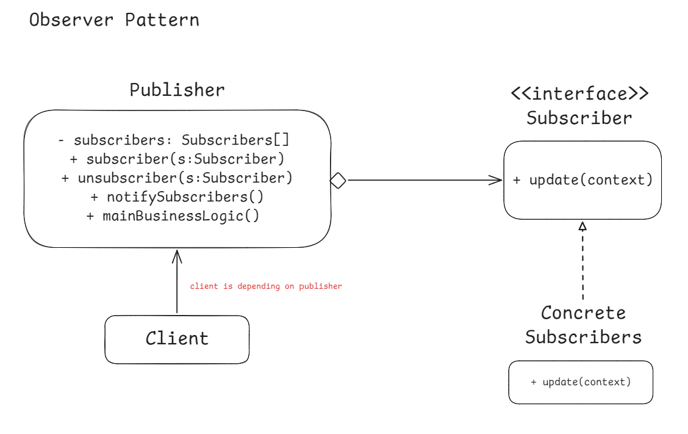

# C++ Observer Pattern – Learning Summary

This document summarizes key learnings, doubts, clarifications, and best practices encountered while implementing and debugging the **Observer Pattern** in C++.

## 1. Core Concepts

| Concept               | Description                                                                |
| --------------------- | -------------------------------------------------------------------------- |
| Observer Pattern      | A behavioral design pattern where a subject notifies observers of changes. |
| Subject (Publisher)   | Maintains a list of observers and notifies them.                           |
| Observer (Subscriber) | Implements an interface to receive updates from the subject.               |
| `Attach()`            | Adds an observer to the subject’s list.                                    |
| `Detach()`            | Removes an observer from the subject’s list.                               |
| `Notify()`            | Calls `Update()` on all attached observers.                                |

## 2. Doubts and Clarifications

| Question                                           | Clarification                                                                  |
| -------------------------------------------------- | ------------------------------------------------------------------------------ |
| Why use `*iterator` in `(*iterator)->Update()`?    | Because `iterator` is to a `IObserver*`. You need to dereference it first.     |
| Why not dereference `.end()`?                      | `.end()` points past the last element; dereferencing it is undefined behavior. |
| Why prefer `++iterator` over `iterator++`?         | Pre-increment avoids a temporary copy and is more efficient.                   |
| Why not use `this->list_observer_`?                | `this->` is optional unless resolving naming conflicts.                        |
| Is `number_` tied to `static_number_` permanently? | No, it's assigned once in the constructor and remains independent afterward.   |
| Why wasn’t `Notify()` triggering?                  | Observer was not attached via `Attach()` or constructor.                       |
| Why was message showing as `"Empty"`?              | Because no message was passed; default was used.                               |
| What is `std::list<IObserver*>::iterator`?         | It's an iterator to walk over a list of `IObserver*` elements.                 |
| Can we use `subject.createMessage()` directly?     | Yes, if `subject` is an object. Use `->` if it’s a pointer.                    |
| When is `this->` required?                         | When resolving variable name conflicts or inside templates.                    |

## 3. Best Practices

| Practice                          | Explanation                                                        |
| --------------------------------- | ------------------------------------------------------------------ |
| Use `++iterator` for efficiency   | Avoids creating unnecessary copies in containers like `std::list`. |
| Attach observer in constructor    | Prevents forgetting to attach manually in `clientCode()`.          |
| Log meaningful updates            | Helps verify that each observer receives the correct message.      |
| Avoid dereferencing `.end()`      | It's not a valid element; only used for loop comparison.           |
| Use `std::unique_ptr` if possible | Avoids manual memory management using `new`/`delete`.              |
| Use `auto` for iterators          | Reduces boilerplate and improves clarity.                          |

## 4. Optional Improvements

| Idea                                     | Benefit                                                  |
| ---------------------------------------- | -------------------------------------------------------- |
| Use range-based `for` loop               | Simplifies iteration: `for (auto* obs : list_observer_)` |
| Improve `RemoveMeFromTheList()` method   | Actually calls `Detach(this)` on the subject.            |
| Implement `PrintInfo()` meaningfully     | Helps identify each observer by ID.                      |
| Add multiple observers in `clientCode()` | Test message broadcast to many listeners.                |

```cpp
#include <iostream>
#include <list>
#include <string>

// Subscriber Interface
class IObserver
{
public:
    virtual ~IObserver() {};
    virtual void Update(const std::string &message_from_subject) = 0;
};

// Publisher Interface
class ISubject

{
public:
    virtual void Attach(IObserver *observer) = 0;
    virtual void Detach(IObserver *observer) = 0;
    virtual void Notify() = 0;
};

class Subject : public ISubject
{
public:
    virtual ~Subject()
    {
        std::cout << "Subject is deleted \n";
    };

    void Attach(IObserver *observer) override
    {
        // Add the latest observer to the end of the queue FIFO
        std::cout << "Attaching observer \n";

        list_observer_.push_back(observer);
    };

    void Detach(IObserver *observer) override
    {
        // Remove the observer from the list
        std::cout << "Detaching observer \n";

        list_observer_.remove(observer);
    };

    void Notify() override
    {
        std::cout << "Notifying Observers \n";

        // Create an iterator from list which will give access to the first item of the list

        std::list<IObserver *>::iterator iterator = list_observer_.begin();

        // Iterate through in a while loop and call the update method on the observer
        while (iterator != list_observer_.end())
        {
            (*iterator)->Update(message_);
            ++iterator;
        };
    };

    void createMessage(std::string message = "Empty")
    {
        this->message_ = message;
        Notify();
    };

private:
    std::string message_;
    std::list<IObserver *> list_observer_;
};

// Subscriber class
class Observer : public IObserver
{
public:
    // Subscriber(Observer) is instantiated with a reference to the Publisher(Subject)
    Observer(Subject &subject) : subject_(subject)
    {
        this->subject_.Attach(this);

        // Increment the number of members
        std::cout << "Observer: " << ++Observer::static_number_ << "\n";

        // Assign the current value to the number_ variable
        this->number_ = Observer::static_number_;
    };

    virtual ~Observer()
    {
        std::cout << "From Observer: " << this->number_ << " >> Deleted \n";
    }

    void Update(const std::string &message_from_subject) override
    {
        std::cout << "From Observer: " << this->number_ << " >> New message from the subject: " << message_from_subject << "\n";
    };

    void RemoveMeFromTheList()
    {
        std::cout << "Removing the observer from the list : \n";

        this->subject_.Detach(this);
    };

    void PrintInfo()
    {
        std::cout << "Information of the Observer : \n";
    };

private:
    std::string message_from_subject_;
    Subject &subject_;
    int number_;
    static int static_number_;
};

int Observer::static_number_ = 0;

void clientCode()
{
    std::cout << "Running Client Code \n";

    Subject *subject = new Subject;
    Observer *observer1 = new Observer(*subject);
    Observer *observer2 = new Observer(*subject);
    Observer *observer3 = new Observer(*subject);
    Observer *observer4 = new Observer(*subject);

    subject->createMessage("Hello world");

    observer1->RemoveMeFromTheList();
    observer2->RemoveMeFromTheList();
    observer3->RemoveMeFromTheList();
    observer4->RemoveMeFromTheList();

    delete observer1;
    delete observer2;
    delete observer3;
    delete observer4;
    delete subject;
};

int main()
{
    std::cout << "Running Observer tests.. \n";
    clientCode();
    return 0;
}
```
