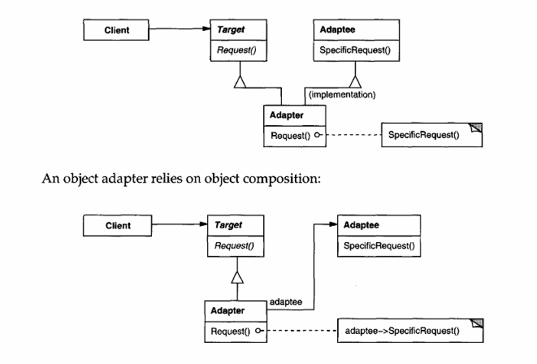
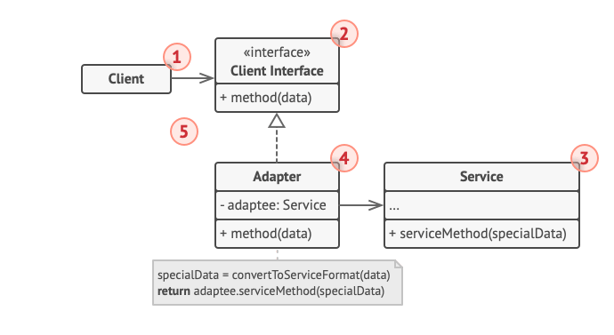

# Adapter Design Pattern (Day 010 - C++ Learning)

The **Adapter** pattern is a structural design pattern that allows objects with incompatible interfaces to work together. It acts as a bridge between a legacy or third-party class (called `Adaptee`) and a system expecting a specific interface (`Target`).

---

## Structure

- **Target (Client Interface)**: The interface that client code knows and expects.
- **Adaptee (Service)**: Existing class with a different/incompatible interface.
- **Adapter**: Implements `Target`, wraps an `Adaptee`, and translates calls.
- **Client**: Works with `Target`, unaware of the actual adaptation behind the scenes.

---

## Example: C++ Implementation

In our C++ code:

- `Target::Request()` is the standard method.
- `Adaptee::SpecificRequest()` returns reversed text (simulating incompatibility).
- `Adapter` wraps an `Adaptee` and overrides `Request()` to reverse the text and return it in a `Target`-compatible way.
- `ClientCode()` works with any class that implements `Target`.

### Sample Output

```
Client: I can work fine with target objects
Client: Default target's behavior

Adaptee: Do you understand the words coming out of me?
Adaptee: .eetpadA eht fo roivaheb laicepS

Client: Let me get an adapter for you
Adapter: (TRANSLATED) Special behavior of the Adaptee.
```

## Key Concepts Learned

| Concept             | Description                                           |
| ------------------- | ----------------------------------------------------- |
| Adapter Pattern     | Bridge between incompatible interfaces                |
| Object Adapter      | Uses composition (`Adapter ➝ Adaptee`)                |
| Target Interface    | What the client understands                           |
| Adaptee             | Class with incompatible method (`SpecificRequest()`)  |
| std::reverse        | Used to reverse a string for translation              |
| Virtual Inheritance | Enables polymorphic behavior with `Target::Request()` |

## Best Practices

- Use Adapter when you can’t modify existing classes (e.g., 3rd-party or legacy).
- Prefer **object adapter** (composition) over **class adapter** (multiple inheritance).
- Keep `Client` dependent on interfaces (`Target`), not concrete classes.

# Implementation

```cpp
#include <iostream>
#include <list>
#include <string>
#include <algorithm>

/**
 * Target defines domain specific interface used by client code
 * Also called the client interface
 */
class Target
{
    // Default behavior of target
public:
    virtual ~Target() = default;

    virtual std::string Request() const
    {
        return "Client: Default target's behavior";
    };
};

/**
 * Also called Service
 * Adaptee needs an adaptation to talk to the target
 */
class Adaptee
{
public:
    std::string SpecificRequest() const
    {
        return ".eetpadA eht fo roivaheb laicepS";
    };
};

/**
 * Adapter lets adaptee work with Adapter
 * Adapter implements Target/Client interface
 */
class Adapter : public Target
{
private:
    Adaptee *adaptee_;

public:
    Adapter(Adaptee *adaptee) : adaptee_(adaptee) {};
    ~Adapter() {};

    // Override the Request from the adapter
    std::string Request() const override
    {
        // IMplement the specificMethod translation
        std::string to_reverse = this->adaptee_->SpecificRequest();
        std::reverse(to_reverse.begin(), to_reverse.end());
        return "Adapter Translated << " + to_reverse + "\n";
    };
};

/**
 * Client code talks to all classes that implements target interface
 */
void ExecuteClientCode(const Target *target)
{
    std::cout << target->Request() << "\n";
};

void clientCode()
{
    std::cout << "Client: I can work fine with target objects \n";

    // Client code runs target without adapter
    Target *target = new Target;
    ExecuteClientCode(target);

    std::cout << "Adaptee: Do you understand the words coming out of me? \n";

    // Service Trying to ping the target
    Adaptee *adaptee = new Adaptee;
    std::cout << "Adaptee: " << adaptee->SpecificRequest() << " \n";

    std::cout << "Client: Let me get an adapter for you \n";
    Adapter *adapter = new Adapter(adaptee);
    ExecuteClientCode(adapter);

    delete target;
    delete adaptee;
    delete adapter;
};


```

# Quiz

### What problem does the Adapter Pattern solve in object-oriented design?

(A) It ensures multiple objects can work together using shared memory.<br>
(B) It allows incompatible interfaces to work together.<br>
(C) It prevents class inheritance and promotes delegation.<br>
(D) It ensures a class has only one instance.<br>

Please answer with the letter and a brief explanation.

Answer :**B**

<br>

It Allows incompatible interfaces to work together.

1. _Refer to the XML to JSON in the Bank example_
2. _When in doubt, think of the Power adapter analogy_
3. _The Adapter Pattern is specifically designed to bridge the gap between two incompatible interfaces, enabling classes to work together that otherwise couldn’t because of interface mismatches._

### Which of the following best describes a class adapter in the GoF Adapter Pattern?

(A) Uses composition to wrap an existing object.<br>
(B) Inherits from both the target interface and the adaptee class.<br>
(C) Requires Java-style annotations to resolve conflicts.<br>
(D) Uses the Bridge pattern internally to link abstraction with implementation.<br>

Answer :**B**

<br>
A class adapter uses multiple inheritance to adapt one interface to another, typically by:

1. Inheriting from the Target (interface expected by the client).
2. Inheriting from the Adaptee (the existing implementation to be reused).

### In the object adapter variant of the Adapter Pattern, how is the adaptee reused?

(A) Through interface inheritance.<br>
(B) Through implementation inheritance.<br>
(C) By instantiating and holding a reference to it.<br>
(D) By directly modifying its source code.<br>

Answer :**C**

<br>
C - By instantiating and holding a reference to it.

- In the object adapter version of the Adapter Pattern, the adapter wraps an instance of the adaptee class and delegates calls to it. This is composition over inheritance, and it's more flexible than the class adapter approach.
- I chose B (implementation inheritance), which describes the class adapter, not the object adapter.

<br> Referring to the solution I implemented, it is infact not A, B or C

```cpp
class Adapter : public Target
{
private:
    Adaptee *adaptee_;

public:
    Adapter(Adaptee *adaptee) : adaptee_(adaptee) {};
    ~Adapter() {};

    // Override the Request from the adapter
    std::string Request() const override
    {
        // IMplement the specificMethod translation
        std::string to_reverse = this->adaptee_->SpecificRequest();
        std::reverse(to_reverse.begin(), to_reverse.end());
        return "Adapter Translated << " + to_reverse + "\n";
    };
};

```

### Which of the following is not a typical use case for applying the Adapter Pattern?

(A) Integrating legacy code into a new system<br>
(B) Bridging APIs between third-party libraries<br>
(C) Enhancing performance by removing polymorphism<br>
(D) Reusing an existing class without modifying it<br>

Answer : **C**

<br>The Adapter Pattern is not intended for performance enhancements or removing polymorphism. Its primary goal is to enable interface compatibility without altering existing code.

1. A, B, and D are valid scenarios where an Adapter is useful.
2. C is unrelated to the pattern's intent and could even be counterproductive.

### Which UML relationship best represents the connection between an Adapter and an Adaptee in the object adapter pattern?

(A) Inheritance (solid line with a closed triangle)<br>
(B) Aggregation (hollow diamond)<br>
(C) Association (solid line)<br>
(D) Dependency (dashed line with open arrow)<br>

Answer : **B**
<br>

1. In the object adapter pattern, the Adapter has-a reference to the Adaptee—this is typically modeled as aggregation in UML:
2. It indicates a whole–part relationship.
3. The Adapter doesn’t own the Adaptee exclusively (like composition), but it uses it.
   <br>
   <br>
   <br>

### Consider this scenario:

Your application expects a class with the method `playAudio`(String filename), but an external library provides a class with `playSoundFile`(String file).

How would you implement an object adapter in this case (pseudo-code or brief explanation)?

Answer :

Correct Answer

```
Client uses AudioPlayer.

AdapterSound implements AudioPlayer and internally calls LegacySoundSystem.playSoundFile.
```

My Answer

```
in this case, the playAudio is client and playSoundFile is the Target

We need to make an adapter called AdapterSound and have a reference ot the client (PlayAudio). Both the playAudio and AdapterSound implements the same Interface. Then when we call the playAudio, we adapt the implementation for the playSoundFile in the PlatyAudio
```

### In which of the following situations would an Adapter Pattern be preferred over the Decorator Pattern?

(A) When you need to add new behavior to an object at runtime<br>
(B) When you want to provide a different interface for an existing object<br>
(C) When you want to restrict access to an object<br>
(D) When you want to share a single instance across different clients<br>

Answer :**B**
<br>

When you want to provide a different interface for an existing object
The Adapter Pattern is all about interface compatibility, not adding new behavior (Decorator), restricting access (Proxy), or sharing instances (Singleton or Flyweight).

### True or False:

> An adapter must always implement all methods of the target interface, even if some methods are not used internally.

Answer :**True** (my answer was `False`)
<br>

My Answer

```
False, only the ones that need to be trnslated or adapted need to be implemented
```

**Correct Answer**

In most statically typed OOP languages (like Java, C#, or C++), if a class implements an interface, it is required to implement all methods of that interface, regardless of whether they’re internally used or not.

Even if only one method calls the adaptee, the adapter must still provide method bodies for all the interface's methods—though they may be empty or throw exceptions.

Your thinking aligns more with dynamic or duck-typed languages (like Python or JavaScript), where you only need to define what's necessary. But in GoF context (OOP languages), full interface compliance is expected.

### You are integrating a payment gateway that provides:

```
public class OldBank {
    public void makeTransfer(double amount) { ... }
}

```

But your system expects:

```
public interface PaymentProcessor {
    void processPayment(double amount);
}

```

Design a class adapter. Show minimal code in Java or pseudo-code.

Answer :
<br>

**My Answer**

We will need a few roles here

1. Target : PaymentProcessor::processPayment
2. Adaptee : OldBank::makeTransfer
3. Adapter: Adapter Implements PaymentProcessor

- Then it will have Adaptee(Bank) as a composition
- When we process payment, then we will ping the OldBank::makeTransfer internally

### What are two potential downsides of using the Adapter Pattern excessively in a large codebase?

Your answer?
<br>
My Answer : It can lead to chaos and result in a scenario where we have too many adapters and redundancy
<br>

**Correct Answer**
Two Key Downsides of Overusing the Adapter Pattern:

1. Proliferation of Adapters (as you rightly said):
   <br>1.1. Overusing adapters can clutter the codebase with redundant or overlapping adapter classes.
   <br>1.2. This increases maintenance overhead and makes it harder for developers to track the actual logic path (especially if adapters are nested or chained).

2. Increased Indirection and Reduced Transparency:
   <br>2.1. Adapters introduce an extra layer of abstraction, which can make the code harder to debug or trace.
   <br>2.2. If overused, it may obscure the actual behavior of the underlying system or API, especially when developers need to understand how a method is ultimately executed.

# Evaluation (Automated : From ChatGPT)

## Adapter Pattern (GoF) – Quiz Summary and Learning Analysis

## 🎯 Objective

To test and reinforce understanding of the **Adapter Pattern** as defined in the **Gang of Four (GoF)** design patterns. The quiz covered theory, UML, and real-world application.

### 📊 Quiz Results

| Question | Topic                                          | Score |
| -------- | ---------------------------------------------- | ----- |
| Q1       | Purpose of Adapter Pattern                     | 5/5   |
| Q2       | Class Adapter (multiple inheritance)           | 5/5   |
| Q3       | Object Adapter (composition usage)             | 2/5   |
| Q4       | Valid use cases of Adapter                     | 5/5   |
| Q5       | UML relationship between Adapter and Adaptee   | 5/5   |
| Q6       | Real-world mapping: `playAudio` vs `playSound` | 3.5/5 |
| Q7       | Adapter vs Decorator distinction               | 5/5   |
| Q8       | Interface compliance in static languages       | 2/5   |
| Q9       | Class Adapter pseudo-code example              | 4.5/5 |
| Q10      | Pitfalls of excessive Adapter use              | 4/5   |

**✅ Total Score: 41 / 50**

## 📈 Strengths

- Clear grasp of **core pattern intent**: bridging incompatible interfaces.
- Good command over **terminology**: Target, Adaptee, Adapter.
- Solid in recognizing **real-world scenarios** and implementation strategy.

## 🔧 Areas to Improve

- **Class vs Object Adapter Distinction**:  
  Clarify when to use inheritance vs composition.

- **Interface Compliance in Static Languages**:  
  Adapters must implement all interface methods, even if unused.

- **Pattern Overuse Awareness**:  
  Understand the long-term maintainability impact of adapter proliferation.

## 📘 Suggested Next Step

Try implementing an actual adapter for a **third-party API** (e.g., adapting Stripe to a generic `PaymentProcessor` interface). This will reinforce the concept in a practical way.

## 🧰 Handy Summary: Adapter Pattern (GoF)

| Component   | Role                                                                   |
| ----------- | ---------------------------------------------------------------------- |
| **Target**  | The interface expected by the client                                   |
| **Adaptee** | The existing class with an incompatible interface                      |
| **Adapter** | Translates calls from Target to Adaptee                                |
| **Client**  | Uses the Target interface without knowing about the Adapter or Adaptee |

**UML (Object Adapter):**
Client --> Target Target <|.. Adapter Adapter --> Adaptee

**UML (Class Adapter):**
Client --> Target Target <|.. Adapter Adaptee <|-- Adapter

🧠 _"Use Adapter when you want to use an existing class, but its interface does not match the one you need."_ — GoF
