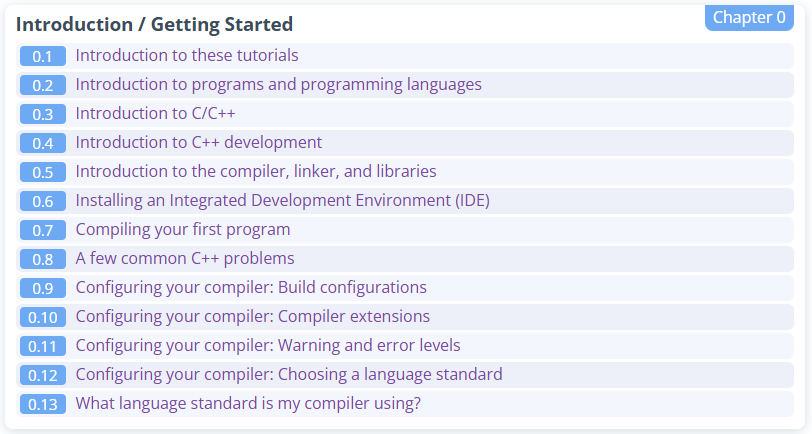

# 📚 Learning C++ Progress Tracker

# Note :

## 20250415

I realised that I am all over the place, jumping in an out, ebbing and flowing. Although it is alright to have a bit of chaos, I looked around and realised that I am not going deep enough to have that sense of understanding to scare away my imposter syndrome. So I looked around and found this site called learncpp.com which covers all the topics in depth, really and the downside being I will be a bit more slower. I guess it is much preferrable to a whale and gulp my Krill slow and get awesome in a consistent manner rather than feeding my already substratial mental drag

So I will be using a hybrid method rather than going EV only (brr.. )

I have also decided against using AI tools being active parter and have decided to relegate them to being passive partners, like a mentor, guiding me to solve issues only when needed, else it is going to etch away on my muscle memory

BR 
Sree

## 20250420

I am using VS Studio Community after a long time and will be using it to get the muscle memory to be where my Python Muscle Memory now. Feels like going to the Gym because it feels deliberate, and it is ofcourse deliberate. I am in no way a born genius, perhaps an Ironman without the Bilionaire Philanthropy shenanigans but with matching passion!

Live Long and Prosper! 
BR 
Sree

## 20250422

Feeling like a novice is a feeling that I hate the most, but one I must endure. I have started, restarted, pivoted, adjusted my strategy and finally have a feeling that I have the right source material with learncpp.com. I am also taking up my notes in Obsidian and using Dataview plugin to pull all my notes together. Some times, just going through the notes, I realize that the barrier is my brain itself. I am wondering how much more could I have learned if I assured myself I could do this before and was not impossible, although difficult. I must also manage the use of generative tools and use it wisely so that It does not hinder my ability to learn and stretch my ability rather than stifle it.

Not sure what I am aiming for all this efforts though, although I must say that it feels good to learn an expand my thinking and thought process itself

Let's Make Life Better, One Line at a Time!

BR 
Sree

## 20250425 D016

So Project Teletrack Sim is my struggle and tribulations in understanding my new assignment and final frontier of programming languages as far as I am concerned, C++. I am doing this as a project to get two birds with one stone: Understanding the Project I am working on as a new Embedded Engineer and Face off with the long dreaded C++ and conquer it.

While at it, I want to do it in style and follow industry standards. So I am using the following:

1. CMake as the build tool
2. Conan for dependency Managment
3. GTest for Unit Testing Management

There will be CI and even CD coming up soon and there will be more to come. Hopefully there is something to the deliberate practice that I have believed in my entire adult life

Live Long and Prosper 
BR 
Sree

# Log

| Day    | Date       | Topic                                                                                  | Status | Code Example / Link                                               |
| ------ | ---------- | -------------------------------------------------------------------------------------- | ------ | ----------------------------------------------------------------- |
| Day 1  | 2025-03-30 | Header Files, Guards, Cmake                                                            | Done   | [D001 Summary](./D001-header-files/README.md)                     |
| Day 2  | 2025-03-31 | Include Guards & MISRA-Safe Headers                                                    | Done   | [D002 Summary](./D002-include-guards/README.md)                   |
| Day 3  | 2025-04-05 | Pointers                                                                               | Done   | [D003 Summary](./D003-pointers/README.md)                         |
| Day 4  | 2025-04-07 | Advanced Pointers – Stack vs Heap, Pointer to Pointer, Dispatch Table                  | Done   | [D004 Summary](./D004-pointers-advanced/README.md)                |
| Day 5  | 2025-04-08 | Project Kickoff – Modular Architecture, Handshake Pattern & Tooling                    | Done   | [D005 Summary](./D005-teletrack-sim-kickoff/README.md)            |
| Day 6  | 2025-04-08 | Project TeleTrackSim : CI Implementation                                               | Done   | [D006 Summary](./D006-ci-implementation/README.md)                |
| Day 7  | 2025-04-09 | Project TeleTrackSim : GoogleTest, CMake, and Conan Integration                        | Done   | [D007 Summary](./D007-gtest-cmake-conan/README.md)                |
| Day 8  | 2025-04-15 | Raw Pointers                                                                           | Done   | [D008 Summary](./D008-raw-pointers/README.md)                     |
| Day 9  | 2025-04-16 | Re-Introduction to Programming                                                         | Done   | [D009 Summary](./D009/README.md)                                  |
| Day 10 | 2025-04-19 | Introduction and Getting Started - Continued                                           | Done   | [D010 Summary](./D010/README.md)                                  |
| Day 11 | 2025-04-20 | Introduction and Getting Started - Continued                                           | Done   | [D011 Summary](./D011/README.md)                                  |
| Day 12 | 2025-04-22 | Introduction and Getting Started - Continued Compiler Extensions                       | Done   | [D012 Summary](./D012/README.md)                                  |
| Day 13 | 2025-04-23 | Structure of the program and Comments + Introduction to Variables and Objects          | Done   | [D013 Summary](./D013/README.md)                                  |
| Day 14 | 2025-04-23 | Setting Skeleton for the Teletrack Sim Project + Conan and GTest with Build Automation | Done   | [D014 Summary](./D014-Teletrack-Sim-Reboot/README.md)             |
| Day 15 | 2025-04-24 | Understanding Variables and Assignments                                                | Done   | [D015 Summary](./D015/README.md)                                  |
| Day 16 | 2025-04-25 | Project Teletrack Sim Spinoff                                                          | Done   | [D016 Summary](./D016-project-teletrack-sim-googletest/README.md) |
| Day 17 | 2025-04-26 | Understanding Conan in depth                                                           | Done   | [D017 Summary](./D017-conan-indepth/README.md)                    |
| Day 18 | 2025-04-27 | Starting with Design Pattern (GoF) : Factory Method                                    | Done   | [D018 Summary](./D018-gof-factory/README.md)                      |
| Day 19 | 2025-04-28 | Starting with Design Pattern (GoF) : Observer Pattern                                  | Done   | [D019 Summary](./D019-gof-observer/README.md)                     |
